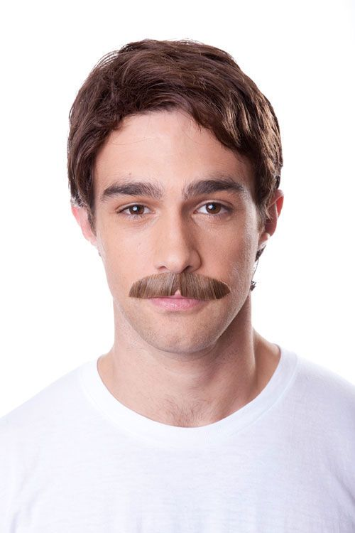

# Friend Match
### Team: Friend Match

Meeting Time: Fridays 4:00 P.M.

### Personas
**Name:** Randolph “Randy” Johnson

=250x250

**Screening Questions:**
Do you have any friends?
Have you moved to a different city recently?
Are you looking to find others with similar interests?

**Narrative:**
Randolph “Randy” Johnson moved to a new city in late February of 2020, and has lost contact with many of his former friends. The lockdowns in his area have prevented him from intermingling with locals and making new friends.

He’s looking for ways to meet new people in his area, but he doesn’t want to use services like Tinder or Bumble, which are geared towards dating rather than friendships. He’s also looking for people who share his interests in crafts, metalworking, and nature. 

**Values:**
Ability to make non romantic connections, matching with people who have common interests as well as different ones
